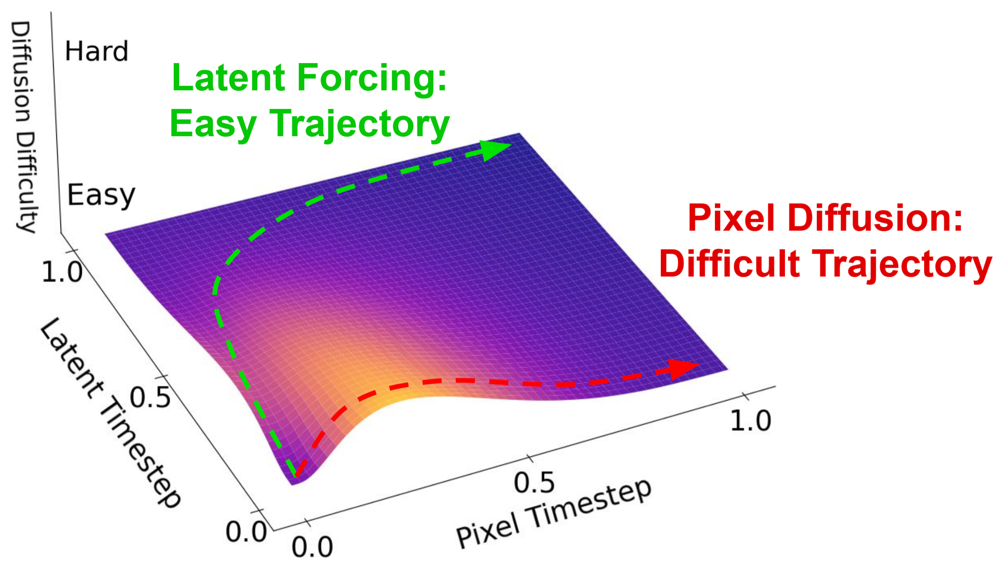

## Latent Forcing: Reordering the Diffusion Trajectory for Pixel-Space Image Generation

[](https://arxiv.org/abs/2602.11401)&nbsp;

<!-- <p align="center">
  
</p> -->


Code for Latent Forcing

```
@article{baade2026latentforcing,
      title={Latent Forcing: Reordering the Diffusion Trajectory for Pixel-Space Image Generation}, 
      author={Alan Baade and Eric Ryan Chan and Kyle Sargent and Changan Chen and Justin Johnson and Ehsan Adeli and Li Fei-Fei},
      journal={arXiv preprint arXiv:2602.11401},
      year={2026},
}
```

Our code is based on JiT: https://github.com/LTH14/JiT.git

<p align="left">
  
</p>

### Dataset
We use [ImageNet](http://image-net.org/download) dataset, and Webdataset.

### Installation

Download the code:
```
git clone https://github.com/AlanBaade/LatentForcing.git
cd LatentForcing
```

Create the conda environment. uv is recommended, but not required.
```bash
conda create -n latentforcing python=3.10
conda activate latentforcing
uv pip install opencv-python==4.11.0.86 numpy==1.23 timm==0.9.12 tensorboard==2.10.0 scipy==1.9.1 einops==0.8.1 gdown==5.2.0 matplotlib==3.10.8 transformers==4.57.3 webdataset==1.0.2
uv pip install torch==2.5.1 --index-url https://download.pytorch.org/whl/cu124
uv pip install "torch-fidelity @ git+https://github.com/LTH14/torch-fidelity.git@master"
```

### Training
Example script for training LatentForcing-L on ImageNet 200 epochs:

```
torchrun --nproc_per_node=8 --standalone \
main_jit.py \
--model JiTCoT-LM/16 \
--D_mean -1.2 --D_std 1.0 \
--P_mean -0.4 --P_std 0.8 \
--batch_size 128 --blr 5e-5 \
--epochs 200 --warmup_epochs 5 \
--gen_bsz 256 --num_images 10000 \
--cfg 1.0 --cfg_dino 1.0 \
--interval_min 0.0 --interval_max 1.0 \
--dino_weight 0.333 --choose_dino_p 0.4 \
--sample_mode dino_first_cascaded_noised \
--dh_depth 2 --dh_hidden_size 1024 \
--output_dir ${OUTPUT_DIR} \
--resume ${OUTPUT_DIR} \
--data_path ${DATA_PATH} \
--online_eval
```

For unconditional training and generation, set ```--label_drop_prob 1.0```

To train a Multi-Schedule model set ```--sample_mode shifted_independent_uniform```

### Evaluation

Evaluate LatentForcing-L with Autoguidance (Default Evaluation Setting)
```
torchrun --nproc_per_node=8 --standalone \
main_jit.py \
--model JiTCoT-LM/16 \
--dh_depth 2 --dh_hidden_size 1024 \
--gen_bsz 1536 --num_images 50000 \
--cfg 1.5 --cfg_dino 1.5 \
--interval_min 0.0 --interval_max 1.0 \
--interval_min_dino 0.0 --interval_max_dino 1.0 \
--sample_mode dino_first_cascaded_noised \
--output_dir ${OUTPUT_DIR_EVAL} \
--resume ${OUTPUT_DIR} \
--data_path ${DATA_PATH} \
--evaluate_gen --num_sampling_steps 50 \
--sampling_method heun \
--guidance_method autoguidance \
--autoguidance_ckpt ${AUTOGUIDANCE_CKPT}$
```

Evaluate LatentForcing-L with Interval CFG (Used in the System-Level comparison only)
```
torchrun --nproc_per_node=8 --standalone \
main_jit.py \
--model JiTCoT-LM/16 \
--dh_depth 2 --dh_hidden_size 1024 \
--gen_bsz 1536 --num_images 50000 \
--cfg 1.5 --cfg_dino 2.9 \
--interval_min 0.0 --interval_max 1.0 \
--interval_min_dino 0.06 --interval_max_dino 1.0 \
--sample_mode dino_first_cascaded_noised \
--output_dir ${OUTPUT_DIR_EVAL} \
--resume ${OUTPUT_DIR} \
--data_path ${DATA_PATH} \
--evaluate_gen --num_sampling_steps 50 \
--gen_shift_dino 0.575 --sampling_method heun \
--guidance_method cfg_interval \
--autoguidance_ckpt ${AUTOGUIDANCE_CKPT}$
```

We use the same customized FID eval as JiT: [```torch-fidelity```](https://github.com/LTH14/torch-fidelity) 

### Checkpoints
Checkpoints for LatentForcing-L at 200 Epochs and Autoguidance can be found at [https://huggingface.co/AlanBaade/LatentForcing/tree/main](https://huggingface.co/AlanBaade/LatentForcing/tree/main).

To use a checkpoint for evaluation, create a folder ${OUTPUT_DIR} and rename the model checkpoint to ``checkpoint-last.pth`` in that folder:
``
mv lfjit-l-200.pth ${OUTPUT_DIR}/checkpoint-last.pth
``
Then use ``--resume ${OUTPUT_DIR}`` as shown in the evaluation code above

For autoguidance, use ``--autoguidance_ckpt /path/to/lfjit-s-dh-40-autoguidance.pth``

Evaluation with 50k steps takes ~35 min on an H100 node. Replicating using this public codebase and Interval CFG, we obtain ``FID: 2.4500, Inception Score: 286.7403``, slightly better performance than reported in the paper.

### Contact

You can contact me at baade@stanford.edu for questions.


